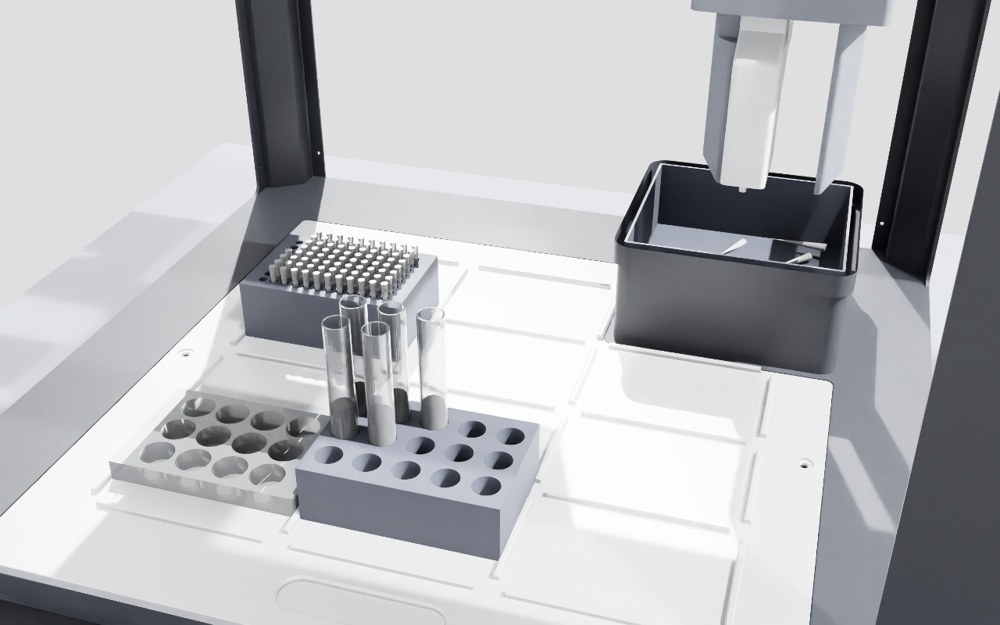

# OT-2 Digital Twin — NVIDIA Isaac Sim

A live, physically-grounded 3D twin of the Opentrons OT-2 that **replays any validated
protocol** and reports whether the run is executable before anyone touches the real robot.



The machine is the real Opentrons reference CAD, split into the parts that actually move.
Labware is generated from the exact Opentrons definitions embedded in the protocol's own
analysis ledger — wells and tube bores are real boolean-cut cavities at true millimetre
dimensions, not approximations. Liquid is volumetric and conserved (1 µL = 1 mm³).

---

## Quick start

Three steps. The GPU work happens on `gear-workstation`; your machine only receives video.

**1. Install the viewer** (once) — Isaac Sim WebRTC Streaming Client 2.0.0:

| Platform | Download |
|---|---|
| macOS (Apple Silicon) | `https://downloads.isaacsim.nvidia.com/isaacsim-webrtc-streaming-client-2.0.0-macos-aarch64.dmg` |
| macOS (Intel) | `…-2.0.0-macos-x86_64.dmg` |
| Windows | `…-2.0.0-windows-x86_64.exe` |
| Linux | `…-2.0.0-linux-x86_64.deb` |

> **macOS:** install with `ditto`, not a Finder drag — a plain copy breaks the Electron
> bundle's signature.
> ```bash
> hdiutil attach ~/Downloads/isaacsim-webrtc-streaming-client-2.0.0-macos-aarch64.dmg
> ditto "/Volumes/Isaac Sim WebRTC Streaming Client/Isaac Sim WebRTC Streaming Client.app" \
>       "/Applications/Isaac Sim WebRTC Streaming Client.app"
> xattr -dr com.apple.quarantine "/Applications/Isaac Sim WebRTC Streaming Client.app"
> ```

**2. Start the twin** (needs the USD VPN + SSH access to `gear-workstation`):

```bash
ssh gear-workstation '~/isaac-twin-live.sh \
  /workspace/ledgers/chemotaxis_prism/analysis.json \
  --speed 0.6 --ui --/app/window/hideUi=0'
```

First start takes ~3 minutes (Isaac compiles RTX shaders on the first frame). Ready when the
log shows `streaming … frames/pass`:

```bash
ssh gear-workstation 'docker logs isaac-twin 2>&1 | grep isaac_twin_live | tail -5'
```

**3. Connect** the client to **`172.22.56.137`**.

Change speed live, without the 3-minute restart:

```bash
ssh gear-workstation '~/isaac-speed.sh 0.25'   # quarter speed
```

---

## Run your own protocol

The twin is driven entirely by a protocol's **analysis ledger**, so any valid OT-2 protocol
works — deck, labware, liquids and motion all come from the protocol itself.

```bash
# 1. validate and produce the ledger
cd paper2protocol
mkdir -p examples/my_run/out
.venv/bin/python -m opentrons.cli analyze \
  --json-output examples/my_run/out/analysis.json \
  examples/my_run/protocol.py

# 2. copy it to the workstation
ssh gear-workstation 'mkdir -p /mnt/ssd/isaac-sim/workspace/ledgers/my_run'
rsync -a examples/my_run/out/analysis.json \
  gear-workstation:/mnt/ssd/isaac-sim/workspace/ledgers/my_run/

# 3. run it
ssh gear-workstation '~/isaac-twin-live.sh /workspace/ledgers/my_run/analysis.json --speed 0.6 --ui'
```

If `analyze` does not report `"result": "ok"`, fix the protocol first — the twin will not run
something the robot itself would reject.

---

## Options

| Flag | Effect |
|---|---|
| `--ui` | **Editor mode** — keeps the Isaac Sim stage tree / property panel visible during the run so you can select and inspect prims. Omit for a clean full-screen view. |
| `--speed 0.25` | Starting playback rate (also live-adjustable). |
| `--liquid-gain 1` | Draw liquid at **true physical scale** (default 9× — see below). |
| `--tube-start 8000` | µL preloaded into each source tube. |
| `--once` | Play once and hold the final frame instead of looping. |
| `--validate` | Build the scene, exercise the liquid system, exit. ~90 s runtime-error check. |
| `--snapshot DIR` | Fast-forward the run and render PNGs from 5 angles — self-check of what is *actually* visible. |

### Why liquid is exaggerated

200 µL in a 6.9 mL Corning well is a true depth of **0.53 mm** in a 17.5 mm deep well. That is
physically correct and completely invisible on screen — you cannot see the bottom of a well
that deep from any normal camera angle. Liquid height is therefore drawn with a visual gain
(default 9×) while the true volume and depth are logged every run. `--liquid-gain 1` renders
exact physical scale.

---

## What it checks

Every run writes `/mnt/ssd/isaac-sim/workspace/out/isaac_live_report.json`:

- **Reachability** — is every well/tube within the pipette's travel range?
- **Collisions** — does the tip strike labware while traversing?
- **Clearance** — smallest tip-to-labware gap during transit.

A `FEASIBLE` verdict means the protocol can be executed as written.

---

## How the assets are built

The Opentrons reference CAD is a single fused, Y-up mesh with the enclosure panels attached —
unusable for animation as shipped. `twin/cad/` rebuilds it. Run these in order only if you need
to regenerate the assets (they are already committed):

| Script | What it does |
|---|---|
| `preview.py` | Loads the reference STL, reports its axes, renders orientation candidates. The mesh is **Y-up** — it needs **+90° about X** to stand on its feet. |
| `dissect.py` | Splits into 4,418 components and drops the **8 flat enclosure panels**, revealing frame, gantry, carriage, deck and trash. |
| `assemble.py` | Detects the deck plane from the geometry (not from stale constants) and bakes the mesh into the functional Opentrons deck frame (deck surface `z=0`). |
| `split_final.py` | Splits into the assemblies that move: `ot2_frame` (static), `ot2_deck`, `ot2_carriage` (X), `ot2_pipette` (Z, the real left-mount pipette). Writes `parts.json` with the nozzle point. |
| `trash_fix.py` / `trash_open.py` | Measures the trash tray from the CAD and **removes its lid** so it is a real open bin that tips fall into. |
| `labware_cad.py` | Generates plate / tube-rack / tip-rack bodies with **boolean-cut cavities** from the ledger's own Opentrons definitions. |
| `tube_cad.py` | Generates a **thin-walled** (1.05 mm) Falcon tube. A solid cylinder with transparency path-traces as a glass *rod* — dark and mirror-like, hiding the contents. |

Toolchain: `trimesh` + `manifold3d` (booleans) + `pyvista` (offscreen render). Set up with:

```bash
python3 -m venv twin/cad/.venv && source twin/cad/.venv/bin/activate
pip install trimesh manifold3d pyvista scipy networkx ezdxf numpy
```

Iterate on renders locally (seconds) rather than in the sim (3-minute boot).

---

## One-time host setup

Already done on `gear-workstation`. Needed only when standing up a **new** machine — the
scripts are in `scripts/isaac/`:

| Script | Purpose | Needs root |
|---|---|---|
| `isaac-setup-privileged.sh` | Adds the user to `docker`, creates SSD/HDD working dirs, reports docker storage. | yes |
| `isaac-migrate-docker.sh` | Moves docker's data-root onto the SSD array (preserves hardlinks; keeps the nvidia runtime in `daemon.json`). | yes |
| `isaac-twin-live.sh` | Launches the twin container. | no |
| `isaac-speed.sh` | Changes playback speed of a running sim. | no |
| `isaac-export-results.sh` | Copies a finished run from SSD scratch to the HDD archive with provenance. | no |

Firewall: WebRTC needs **TCP 49100** *and* **UDP 47998**. TCP alone is not enough.

---

## Troubleshooting

| Symptom | Cause / fix |
|---|---|
| Client won't connect | Check VPN, then `nc -z 172.22.56.137 49100`. Both TCP 49100 and UDP 47998 must be open. |
| Black screen after connecting | Sim still booting (~3 min) or not running: `docker ps --filter name=isaac-twin`. |
| Connects then freezes | Two sims fighting for port 49100. Only one container may run: `docker ps --filter name=isaac`. |
| Everything renders grey | Started with the **minimal** boot, which does not load the RTX material pipeline. Use `isaac-twin-live.sh`. |
| Wells look empty | You are at the start of a pass; the plate fills over the pass and resets on loop. Try `isaac-speed.sh 0.25`. |
| Stop the sim | `docker rm -f isaac-twin` |

### Host requirements (learned the hard way)

Isaac Sim **6.0.1 requires driver ≥ 595** and an RTX 4080 minimum; **5.1 requires 580**.
`gear-workstation` has driver **535** and an RTX 3080 Laptop, so it runs **isaac-sim:5.0.0**
with `--/rtx/verifyDriverVersion/enabled=false`. On 6.0.1 the RTX renderer never acquires a
viewport and hangs forever with no crash.

The container runs as **uid 1234**, not root — bind-mounted cache dirs must be writable by it
or the RTX texture cache fails and the app hangs at startup.

---

## ⚠ Asset licensing

`twin/assets/ot2/` contains geometry derived from
[`Opentrons/ot2`](https://github.com/Opentrons/ot2) `reference-model/STL/`. That repository has
**no LICENSE file** — GitHub's licence API returns 404 — so the CAD is **unspecified /
all-rights-reserved**, softened only by the repo README's grant that Opentrons provides these
files for the community to modify their own OT-2 robots. We rely on that grant for
research/visualisation use.

**This repository is private.** If it is ever made public, remove the derived CAD
(`twin/assets/ot2/*.stl`, `*.step`, `*.dxf`) and have users regenerate it from upstream with
`twin/cad/`. Do not assume an OSI licence. Full provenance, hashes and measurements:
`twin/assets/PROVENANCE.md`.
