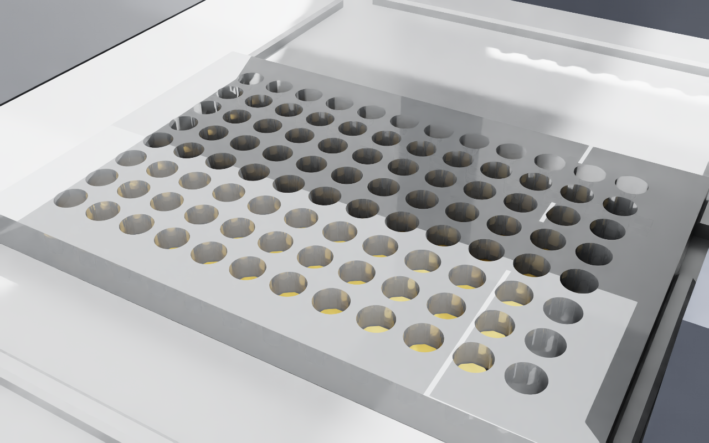
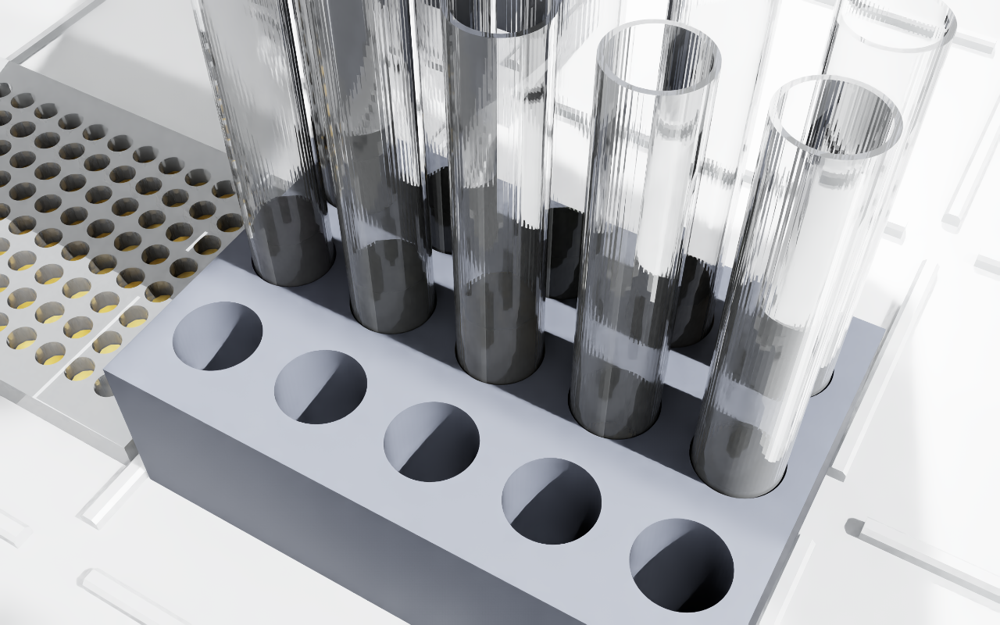

# Replication 01 — MIC of olive leaf extract against *L. monocytogenes*

**Paper:** Liu et al., *PLOS ONE* 17(1):e0263359 (2022) — `10.1371/journal.pone.0263359`
**Status:** ✅ replicated in the twin — 11/11 conformance checks, FEASIBLE, rendered and measured
**Artifacts:** `examples/mic_ole/` (protocol, ledger, claims, twin report) · evidence images below

---

## What the paper specifies

Quoted from *Materials and methods → "Inhibitory assays of OLE against L. monocytogenes"*:

> "eight OLE concentrations (128.0, 64.0, 32.0, 16.0, 8.0, 4.0, 2.0, and 1.0 mg/ml) were
> generated by two-fold serial dilutions using BHI broth. Fifty microliters (50 μL) of OLE at
> each concentration and 50 μL of diluted *L. monocytogenes* F2365 overnight culture, total
> 100 μL, were mixed into each well of the plate."

> "Eight replicates (on the plate) were set up for each OLE concentration condition."

Equation 1 additionally requires three controls: **PC** (culture only), **NC** (BHI only), and
**OLE-only** at each concentration.

## What the protocol does

`examples/mic_ole/protocol.py` — p300 single GEN2 on the left mount, deck:

| Slot | Labware |
|---|---|
| 1 | `corning_96_wellplate_360ul_flat` — assay plate |
| 2 | `opentrons_15_tuberack_falcon_15ml_conical` — dilution series + BHI + culture |
| 7 | `opentrons_96_tiprack_300ul` |

Plate layout: columns 1–8 are the eight concentrations (rows A–H = the eight replicates),
column 9 the OLE-only controls, column 10 PC, column 11 NC. **88 of 96 wells used.**

`opentrons analyze` → **`result: ok`, 0 errors**, first pass. 520 commands: 18 `pickUpTip`,
239 `aspirate`, 239 `dispense`, 18 `dropTip`.

Transfers are deliberately kept **1:1** (one aspirate per dispense) rather than multi-dispensed,
so every dispense pairs unambiguously with its source and the ledger stays auditable.

## Verification

### 1. Conformance — derived from behaviour, not from the source

`scripts/replication_check.py` simulates every aspirate/dispense against a container model and
tests the paper's numbers against what the run *does*. It never reads `protocol.py`: a check
that grepped the code for `128.0` would happily pass a protocol that merely mentions it.

```
[PASS] labware slot 1                          corning_96_wellplate_360ul_flat
[PASS] labware slot 2                          opentrons_15_tuberack_falcon_15ml_conical
[PASS] labware slot 7                          opentrons_96_tiprack_300ul
[PASS] dilution series realized                expected [128,64,32,16,8,4,2,1], realized [128,64,32,16,8,4,2,1]
[PASS] 8 replicates per concentration          {128:8, 64:8, 32:8, 16:8, 8:8, 4:8, 2:8, 1:8}
[PASS] every assay well = 100.0 uL             off-volume wells: none
[PASS] every plate dispense = 50.0 uL          all uniform
[PASS] positive control (culture, no OLE)      8 wells: A10–H10
[PASS] negative control (broth only)           8 wells: A11–H11
[PASS] OLE-only control at each concentration  8 wells covering 8/8 concentrations
[PASS] tips used                               18 tips

11/11 checks passed
```

The dilution-series line is the load-bearing one: those concentrations were **computed by
simulating the mixing**, not asserted. The protocol genuinely realizes the paper's series.

### 2. Physical feasibility

```
VERDICT: FEASIBLE — all targets reachable, no collisions
514 steps | reachable_all: True | collisions: 0 | min transit clearance: 20.0 mm
```

### 3. Executed in the twin, then measured

Full run replayed (514 steps). Final state **matches the conformance prediction exactly**:

| Expected | Twin reported |
|---|---|
| 88 wells filled (64 EG + 8 OLE-only + 8 PC + 8 NC) | **88 wells filled** |
| 18 tips consumed | **18 tips in trash** |

Rendered checkpoints were **measured, not eyeballed** — colour saturation sampled per view to
confirm reagent actually reaches the renderer:

| View | Coloured px | Dominant RGB | Reading |
|---|---|---|---|
| plate | 7,704 | (168, 144, 120) | amber, red > blue ✅ |
| tubes | 4,244 | (216, 192, 144) | amber, red > blue ✅ |
| tiprack | 0 | — | correct: plastic, no liquid |
| trash | 0 | — | correct: used tips only |





## Two bugs this replication exposed

**1. A single global liquid gain cannot serve different labware.** The gain tuned for a 12-well
Corning plate (where 200 µL is a 0.53 mm film) rendered 100 µL in a 96-well plate as 52 mm in a
10.7 mm well — every well would have clamped to full and *all volume information would have been
lost*. Gain is now computed **per labware** from the volumes the protocol actually dispenses, so
the largest fill reads ~55 % of well depth. This run: `auto -> [1.0, 2.02]`, giving
`100 uL = 2.91 mm true, shown 5.87 mm at 2.02x in a 10.7 mm well`.

**2. Labware assets were keyed by deck slot,** so a second paper using slots 1/2/7 silently
overwrote the first paper's geometry. Now keyed by load name and merged, so all five papers
share one asset directory.

## Open items for sign-off

The paper does **not** state the physical volumes used to build the dilution series — only that
it was two-fold in BHI. These are **our** decisions, flagged in the protocol header, and are the
kind of thing that needs a human eye before any wet-lab run:

- 700 µL equal-volume steps in 15 mL conicals (leaves ≥ 450 µL per concentration after passing
  700 µL on — enough for 9 × 50 µL).
- The plate layout above; the paper fixes only the replicate count.
- Fresh tip on every liquid change.
- Tube A1 is preloaded by the operator with OLE at 128 mg/mL.

Steps outside a liquid handler's scope — 24 h incubation at 37 °C and the OD600 read — are
emitted as a labelled handoff comment, not silently dropped.

## Reproduce it

```bash
# validate + ledger
.venv/bin/python -m opentrons.cli analyze \
  --json-output examples/mic_ole/out/analysis.json examples/mic_ole/protocol.py

# conformance against the paper's claims
.venv/bin/python scripts/replication_check.py \
  examples/mic_ole/out/analysis.json examples/mic_ole/claims.json

# watch it in the twin (editor mode)
ssh gear-workstation '~/isaac-twin-live.sh /workspace/ledgers/mic_ole/analysis.json --speed 0.6 --ui'
```
